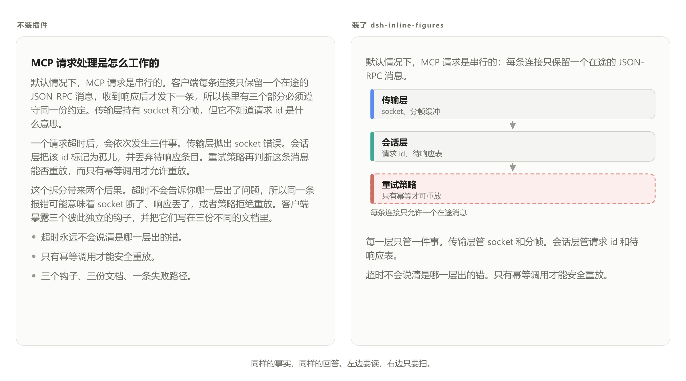
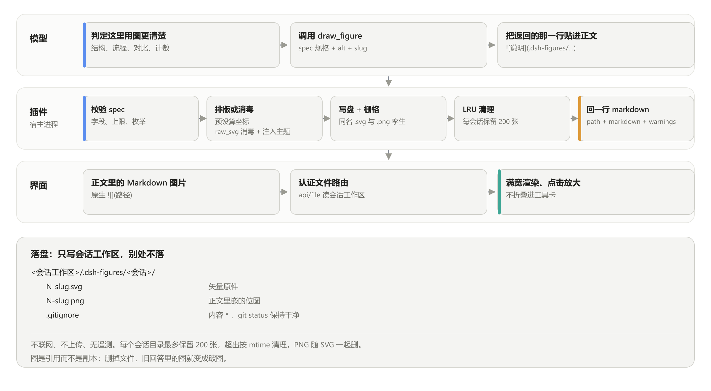

# dsh-inline-figures

[](CHANGELOG.md)
[](LICENSE)
[](https://github.com/0mao0/dsh-inline-figures/actions/workflows/ci.yml)

[English](README.md) | **中文**

| name | dsh-inline-figures |
|---|---|
| description | 当你需要"看懂"而不是"扫过"一段 DeepSeek Harness（DSH）回答时用它。它给模型一个 `draw_figure` 工具，把干净的矢量图渲染在回复的段落之间——文字、图、文字——于是部件与关系、流程、顺序、对比、计数变成一张图，而不是一堵文字墙。图是确定性生成的 SVG，落在会话工作区，走普通 Markdown 图片通道嵌入：不会折叠进工具卡，也不需要客户端代码或新界面。 |

**关键词。** DeepSeek Harness 插件 · DSH 宿主插件 · Cordis bundle · `draw_figure` · 正文内联图 · 文字-图-文字回答 · 聊天里的矢量图 · ASD-STE100 图内标签 · 模型输出可读性



*同样的事实，同样的回答。左：纯 Markdown。右：模型把结构画了出来，并删掉了它替换掉的那段话。*

## 为什么做这个

模型的回答常常是一堵文字墙。有两个公认的解法，这个插件两个都做：

- **写得更朴素。** 注入的引导语要求解释性文字按约 80% 的 **ASD-STE100** 来写——即航空维修手册使用的受控英语。Andrej Karpathy [推荐用 ASD-STE100](https://www.searchenginejournal.com/karpathy-llm-aircraft-manual-writing/591813/) 解决这个问题，并把[图排在文字之上](https://www.explainx.ai/blog/karpathy-understand-llm-outputs-ste100-diagrams-html-video-2026)，作为理解模型输出的下一步。这里的图内标签是同一风格里更严的一档：名词短语、最多六个词、一个标签一个概念。
- **把结构画出来。** 凡是有部件、流程、顺序、对比、计数的内容，就画成图而不写成段落，放在它该说明的位置。

## 它怎么工作



一个回合三步。模型判定某处该有图，调用 `draw_figure`；宿主插件校验规格、渲染、写文件，回一行 Markdown；模型把这一行贴进正文，普通的 Markdown 图片把它渲染成满宽图。没有新界面，也没有客户端代码——图走的是消息里任何一张图片都走的同一条通道。

### 模型忘了画的时候

工具无法自己把内容放进回复里，所以插件从宿主侧补上这一步：它读取模型即将发出的那段回答，如果里面带着结构（表格、五条以上的列表、对照、计划、流程）却一张图都没有，就在 `agent/turn-stopping` 处给 agent 发一次 steer。steer 会重新打开收件箱，模型因此必须再走一步，在回答发出前把图画出来。这条通道每个会话最多触发两次、两次之间隔两个回合，并且只在会话已经画过图之后才启用；从没画过图的会话改用挂在下一个工具结果上的提醒，不额外消耗模型步数。

## 安装

DSH 自带插件管理器。你不需要手工拷文件，也不需要在 profile 里跑包管理器。

```powershell
# 从 npm 安装
dsh plugin --profile <profile> add dsh-inline-figures

# 或直接从本仓库安装，不经过 registry
dsh plugin --profile <profile> add github:0mao0/dsh-inline-figures
```

Web 侧边栏的 **Plugins** 页有同样的表单入口；也可以让 agent 用 `plugin_manager` 工具装（`install_bundle`，target 指向本地克隆目录）。

装完**重启 DSH**。宿主侧的插件代码每个进程只加载一次，所以要重启才会载入新的模块代；在那之前插件列表可能还显示旧状态。

没有构建步骤。本插件 import 的包由宿主提供；负责让图能预览的 `sharp` 自带预编译二进制。

### 装之前宿主会检查什么

`package.json` 用 **peerDependencies** 钉住了这一版验证过的 DSH 运行版本（`@deepseek-ai/dsh-*`）。插件管理器先评估这些 peer：运行版本不匹配就直接拒绝安装并报 `incompatible-version`——干净地拒绝，而不是装上去再出问题。确实想在别的运行版本上跑，就授一条精确版本豁免：

```powershell
dsh plugin --profile <profile> allow-version dsh-inline-figures@<version> --dsh-version <runtime> --accept-risk
```

已验证版本：**dsh 0.2.0-rc.2**（cordis 4.0.4）。如果机器完全连不上 registry，[docs/MAINTAINER-NOTES.md](docs/MAINTAINER-NOTES.md) 保留了一套离线安装器，属于不受支持的兜底方案。

## `draw_figure` 工具

```
draw_figure({ spec, alt, slug? }) -> { path, markdown, warnings }
```

预设图型由引擎排好版——这类图永远不要手写坐标：

```json
{ "kind": "compare", "title": "现状 vs 目标",
  "rows": [{ "left": { "label": "人工复核" },
             "right": { "label": "自动门禁", "tone": "ok" } }] }
```

返回的这一行，原样贴进正文：

```

```

| `kind` | 形状 | 上限 |
|---|---|---|
| `raw_svg` | 手写 SVG：树、分支流水线、状态机、任何自定义结构 | 规格 32 KB |
| `architecture` | 分层方框、P0/P1 徽章、danger 分组、反馈边 | 2–6 层 × 每层 1–6 节点、8 条边 |
| `compare` | 左右对照列，带语义色（`default`/`danger`/`ok`/`muted`） | 1–6 行 |
| `timeline` | 纵向步骤，标 `done`/`active`/`todo` | 2–10 步 |
| `chart` | `bar`、`line` 或 `pie`，带轴刻度与标签自动旋转 | 1–12 个数据点 |

规格在排版前先校验，每条错误都点名出错的字段。所以坏调用回来的是可修的提示，而不是一张坏图。图永远是 SVG——绝不用 ASCII 字符画、Unicode 制表符或代码块。

`raw_svg` 是自由结构的首选路径。消毒器拒绝 script、doctype、实体与 iframe，剥掉事件属性、外部引用、`<image>` 与 `<foreignObject>`，然后注入主题样式表和箭头 marker；手写的图因此照样跟随当前配色。

## 它往磁盘写什么

只写会话工作区，别处不落，也不离开这台机器。

```
<会话工作区>/.dsh-figures/<会话>/
├── N-slug.svg     矢量原件
├── N-slug.png     正文里嵌的位图
└── .gitignore     内容 * ，所以 git status 保持干净
```

- **不联网、不上传、无遥测。** 渲染全在本地；一个回合里唯一的网络流量就是模型调用本身。
- **按会话分目录。** 图落在画它的那个会话目录里。每个目录只保留最新 200 张，超出按修改时间清理，被清掉的 SVG 连同它的 PNG 孪生一起删除。
- **图是引用，不是副本。** 删掉文件，旧回答里的图就变成破图——把这个目录当成对话的一部分，而不是可随手清理的临时文件。
- **栅格化失败时**，正文改嵌 SVG 的 data URI，图仍然能显示；插件同时把这次失败追加写进本目录的 `raster-diagnostic.txt`。不能退回到相对路径的 `.svg` 链接：GUI 给图片文件带的是 CSP `sandbox` 头，Chromium 拒绝把这种来源的 SVG 光栅化，它只会渲染成破图。

每次出图不会在别处留下东西。只有两处安装期产物可能在会话工作区之外：离线兜底安装器在 `~/.dsh/vendor` 下的暂存副本，以及 profile `node_modules` 里的 `sharp`。

## 不装 DSH 也能用这个引擎

`lib/` 不 import 任何 `@deepseek-ai/*` 或 cordis，并有测试强制这一点。`./engine` 入口就是一个普通模块：

```js
// 从仓库克隆：import { ... } from './lib/engine.js'
// 从安装的包：import { ... } from 'dsh-inline-figures/engine'
import { drawFigure, validateSpec, sanitizeSvg, GUIDANCE_TEXT } from './lib/engine.js'

const { svg, warnings } = drawFigure({
  kind: 'timeline', title: '上线计划',
  steps: [{ label: '设计', state: 'done' }, { label: '开发', state: 'active' }],
})
```

要在自己的 agent 里复用它：用同样的 schema 注册一个等价工具，把 `GUIDANCE_TEXT` 贴进系统提示，然后把返回的 SVG（或你自己栅格化的结果）交给你的 Markdown 图片通道。

## 开发

```powershell
node --test                                            # 全量测试，零依赖
$env:UPDATE_GOLDEN='1'; node --test test/architecture.test.js   # 重新生成布局快照，然后目检 diff
node scripts/make-readme-image.mjs                     # 重新生成 before/after 对比图
node scripts/make-readme-diagram.mjs                   # 重新生成原理图
node scripts/_repro-png-check.mjs                      # 真实 cordis：挂载插件、跑完五种图型、并验证卸载清理
node scripts/_repro-nudge.mjs                          # 真实 cordis：驱动计数器兜底那条提醒通道
node scripts/_repro-nudge-channels.mjs                 # 真实 cordis：证明收尾通道会 steer，且对已有图或原子回答保持安静
$env:DSH_INLINE_FIGURES_SHARP='C:\nonexistent.cjs'; node scripts/_repro-degrade.mjs   # 让所有光栅化层都失败：验证 data URI 与诊断文件
```

`test/compliance.test.js` 是官方宿主契约的门禁，规则见上面[「装之前宿主会检查什么」](#装之前宿主会检查什么)：宿主包必须是 peer、兼容门禁必须武装、patch 行名必须等于包名、身份必须可发布、展示元数据必须齐全、每个资源都必须走 `ctx.effect` 注册。

在受限沙箱的 shell 里，`node --test` 可能因 `spawn EPERM` 失败（它为每个测试文件 spawn 一个子进程）。`node --test --test-isolation=none` 在单进程里跑同一套测试。

发版步骤、未修问题、离线安装兜底都写在 [docs/MAINTAINER-NOTES.md](docs/MAINTAINER-NOTES.md)。

## 许可证

[MIT](LICENSE)
