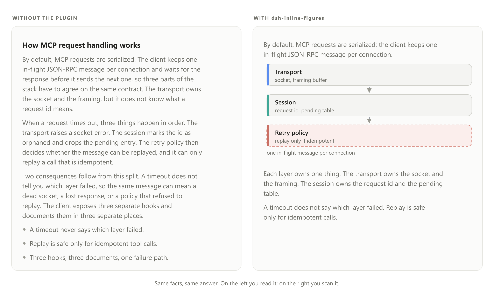
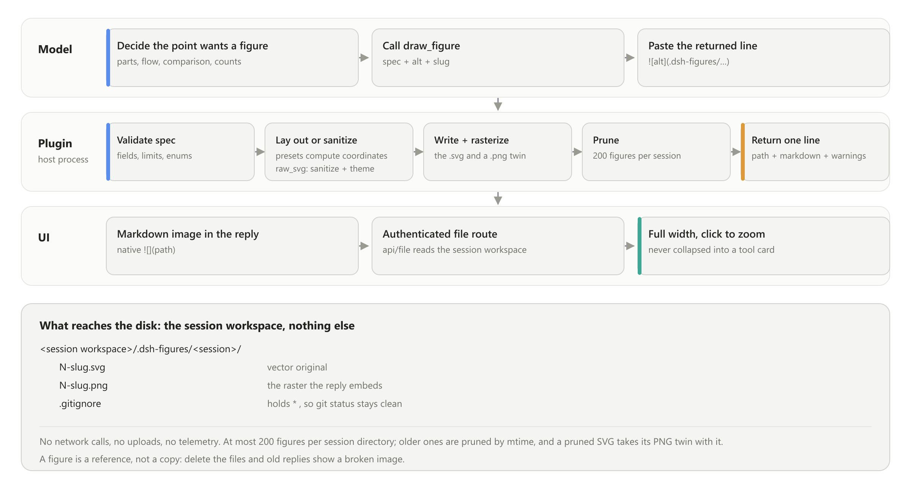

# dsh-inline-figures

[](CHANGELOG.md)
[](LICENSE)
[](https://github.com/0mao0/dsh-inline-figures/actions/workflows/ci.yml)

**English** | [中文](README-zh.md)

| name | dsh-inline-figures |
|---|---|
| description | Use dsh-inline-figures when a DeepSeek Harness (DSH) answer has to be understood rather than skimmed. It gives the model a `draw_figure` tool that renders clean vector figures inline between the paragraphs of its reply - text, figure, text - so parts and relations, flows, sequences, comparisons and counts become a picture instead of a wall of text. Figures are deterministic SVG written into the session workspace and embedded through the ordinary Markdown image channel: nothing collapses into a tool card, and no client code or new UI is involved. |

**Keywords.** DeepSeek Harness plugin · DSH host plugin · Cordis bundle · `draw_figure` · inline SVG figures · text–figure–text answers · vector diagrams in AI chat · ASD-STE100 figure labels · LLM output readability



*Same facts, same answer. Left: plain Markdown. Right: the model drew the structure and deleted the paragraph it replaced.*

## Why

Long model answers are walls of text. Two fixes are well known, and this plugin does both:

- **Write plainer.** The injected guidance asks for prose at roughly 80% **ASD-STE100** — Simplified Technical English, the controlled language of aircraft maintenance manuals. Andrej Karpathy [recommended ASD-STE100](https://www.searchenginejournal.com/karpathy-llm-aircraft-manual-writing/591813/) for exactly this problem, and [ranked diagrams above prose](https://www.explainx.ai/blog/karpathy-understand-llm-outputs-ste100-diagrams-html-video-2026) as the next step for understanding a model's output. Figure labels here are the strictest tier of the same style: noun phrases, six words at most, one concept per label.
- **Draw the structure.** Anything with parts, flow, sequence, comparison, or counts becomes a figure instead of a paragraph, placed at the point it illuminates.

## How it works



One turn, three moves. The model decides that a point needs a figure and calls `draw_figure`; the host plugin validates the spec, renders it, writes the file, and returns one Markdown line; the model pastes that line into the reply, where the ordinary Markdown image renders it full width. There is no new UI and no client code — the figure travels the same image channel as any other picture in a message.

### When the model forgets

A tool cannot place anything in a reply by itself, so the plugin closes the gap from the host side. It reads the answer the model is about to close on, and when that answer carries structure — a table, five or more list items, a comparison, a plan, a flow — with no figure at all, it steers the agent at `agent/turn-stopping`. Steering re-opens the inbox, so the model owes another step and draws the figure before the answer ships. That path is capped at two steers per session with a two-turn gap, and it only arms once the session has drawn at least once; a session that never draws is answered with a reminder attached to the next tool result instead, which costs no extra model step.

## Install

DSH has its own plugin manager, so nothing is copied by hand and no package-manager command runs against your profile.

```powershell
# from npm
dsh plugin --profile <profile> add dsh-inline-figures

# or straight from this repository, no registry involved
dsh plugin --profile <profile> add github:0mao0/dsh-inline-figures
```

The Web sidebar's **Plugins** page does the same thing with a form, and an agent can do it with the `plugin_manager` tool (`install_bundle`, target = the directory of a local clone).

Then **restart DSH**. Host-side plugin code is loaded once per process, so a fresh JavaScript generation needs a restart; the plugin list can keep showing the previous state until then.

There is no build step. The harness supplies the packages this plugin imports, and `sharp` — the rasterizer behind previewable figures — ships prebuilt binaries.

### What the harness checks before it installs

`package.json` pins the DSH runtime version this release was verified against, as **peer dependencies** on `@deepseek-ai/dsh-*`. The plugin manager evaluates those peers first and refuses an install on a different runtime with `incompatible-version` — a clear refusal, instead of a plugin that mounts and then misbehaves. To run it on another runtime anyway, grant the exact-version exemption:

```powershell
dsh plugin --profile <profile> allow-version dsh-inline-figures@<version> --dsh-version <runtime> --accept-risk
```

Verified against **dsh 0.2.0-rc.2** (cordis 4.0.4). If you need a machine that cannot reach a registry at all, [docs/MAINTAINER-NOTES.md](docs/MAINTAINER-NOTES.md) keeps the offline installer as an unsupported fallback.

## The `draw_figure` tool

```
draw_figure({ spec, alt, slug? }) -> { path, markdown, warnings }
```

A preset spec, laid out for you — never hand-write coordinates for these:

```json
{ "kind": "compare", "title": "Current vs target",
  "rows": [{ "left": { "label": "Manual review" },
             "right": { "label": "Automated gate", "tone": "ok" } }] }
```

The returned line, to paste verbatim:

```

```

| `kind` | Shape | Limits |
|---|---|---|
| `raw_svg` | Hand-authored SVG for trees, branching pipelines, state machines, anything custom | 32 KB spec |
| `architecture` | Layered boxes, P0/P1 badges, danger groups, feedback edges | 2–6 layers × 1–6 nodes, 8 edges |
| `compare` | Left/right columns with semantic tones (`default`/`danger`/`ok`/`muted`) | 1–6 rows |
| `timeline` | Vertical steps marked `done`/`active`/`todo` | 2–10 steps |
| `chart` | `bar`, `line` or `pie`, with axis ticks and label auto-rotation | 1–12 points |

Specs are validated before layout and every error names its field, so a bad call comes back as a fixable message instead of a broken image. Figures are always SVG — never ASCII art, Unicode box drawing, or a code block.

`raw_svg` is the primary path for free-form structure. The sanitizer rejects scripts, doctypes, entities and iframes, strips event attributes, external references, `<image>` and `<foreignObject>`, then injects a theme stylesheet and an arrow marker, so a hand-authored figure still follows the active colour scheme.

## What it writes to disk

Only the session workspace, and nothing leaves the machine.

```
<session workspace>/.dsh-figures/<session>/
├── N-slug.svg     vector original
├── N-slug.png     the raster the reply embeds
└── .gitignore     holds *, so git status stays clean
```

- **No network calls, no uploads, no telemetry.** Rendering happens locally; the only traffic in a turn is the model call itself.
- **Per session.** A figure lands in the directory of the session that drew it. Each directory keeps its newest 200; older ones are pruned by modification time, and a pruned SVG takes its PNG twin with it.
- **A figure is a reference, not a copy.** Delete the files and old replies show a broken image, so treat the directory as part of the conversation, not as scratch space.
- **If rasterization fails**, the reply embeds the SVG as an inline data URI instead, so the figure still renders, and the plugin appends the failure to `raster-diagnostic.txt` in this directory. A relative `.svg` link cannot be used as a fallback: the GUI serves figure files with a CSP `sandbox` header, and Chromium refuses to rasterize an SVG loaded that way — it renders as a broken image.
- **If the host cannot draw CJK**, the PNG's Chinese/Japanese/Korean labels come out as empty boxes while the raster still succeeds: the `.svg` original is correct, so nothing in the embed path can show the loss. When a spec contains CJK and the host has no font covering it, the plugin says so in the tool result and appends it to `raster-diagnostic.txt`. Install one (`apt-get install -y fontconfig fonts-noto-cjk`) and draw the figure again.

Nothing else is written per answer. Two install-time artefacts can exist elsewhere: the offline fallback's staging copy under `~/.dsh/vendor`, and `sharp` in the profile's `node_modules`.

## Use the engine without DSH

`lib/` imports nothing from `@deepseek-ai/*` or cordis, and a test enforces it. The `./engine` entry is a plain module:

```js
// from a clone:        import { ... } from './lib/engine.js'
// from the package:    import { ... } from 'dsh-inline-figures/engine'
import { drawFigure, validateSpec, sanitizeSvg, GUIDANCE_TEXT } from './lib/engine.js'

const { svg, warnings } = drawFigure({
  kind: 'timeline', title: 'Rollout',
  steps: [{ label: 'Design', state: 'done' }, { label: 'Build', state: 'active' }],
})
```

To reuse it in your own agent: register an equivalent tool with the same schema, paste `GUIDANCE_TEXT` into your system prompt, and render the returned SVG (or your own raster of it) through your Markdown image channel.

## Development

```powershell
node --test                                            # full suite, no dependencies
$env:UPDATE_GOLDEN='1'; node --test test/architecture.test.js   # refresh layout snapshots, then eyeball the diff
node scripts/make-readme-image.mjs                     # rebuild the before/after images
node scripts/make-readme-diagram.mjs                   # rebuild the how-it-works diagrams
node scripts/_repro-png-check.mjs                      # real cordis: mounts the plugin, executes all five kinds, proves unload cleanup
node scripts/_repro-nudge.mjs                          # real cordis: drives the counter-fallback nudge channel
node scripts/_repro-nudge-channels.mjs                 # real cordis: proves the closing-turn channel steers, and stays quiet on a figure-bearing or atomic answer
$env:DSH_INLINE_FIGURES_SHARP='C:\nonexistent.cjs'; node scripts/_repro-degrade.mjs   # forces every raster layer to miss: data URI + diagnostic
```

`test/compliance.test.js` is the gate for the official host contract described under [Install](#what-the-harness-checks-before-it-installs): host packages as peers, the compatibility check armed, the patch row matching the package name, publishable identity, the display metadata, and every resource registered through `ctx.effect`.

Under a sandboxed shell, `node --test` can fail with `spawn EPERM` (it spawns one child per test file). `node --test --test-isolation=none` runs the same suite in one process.

Release steps, open defects, and the offline-install fallback live in [docs/MAINTAINER-NOTES.md](docs/MAINTAINER-NOTES.md).

## License

[MIT](LICENSE)
